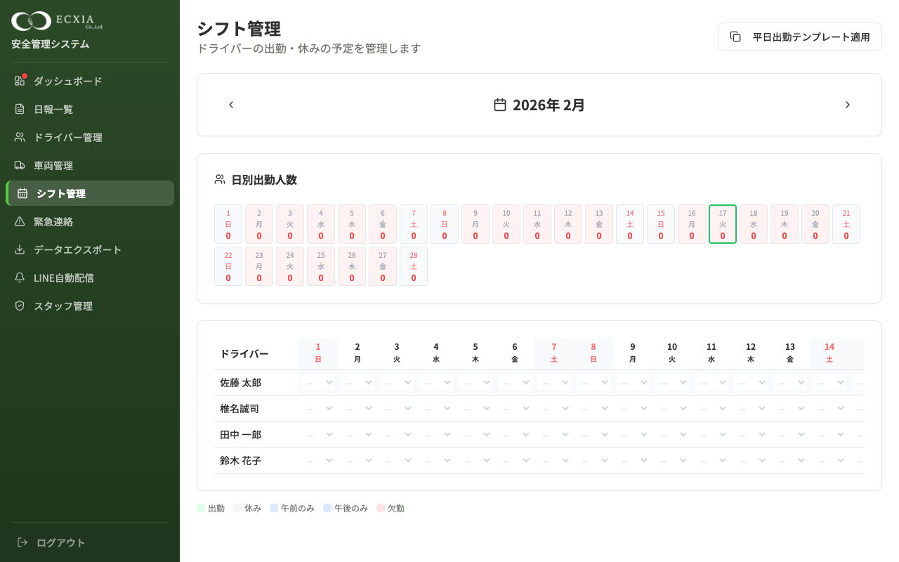
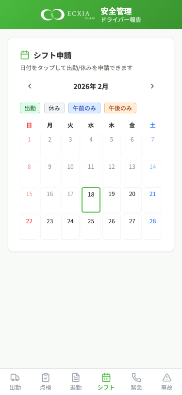
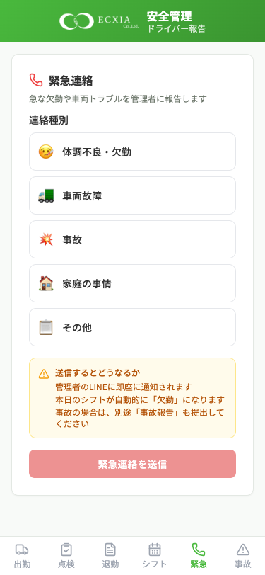
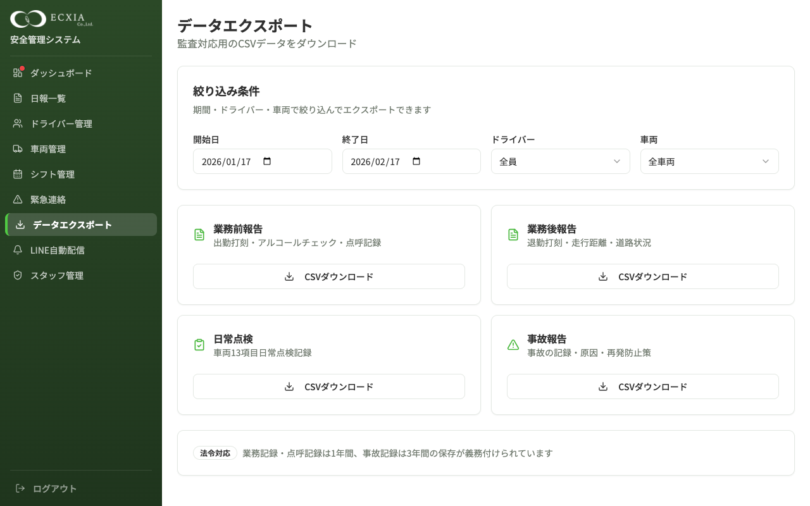
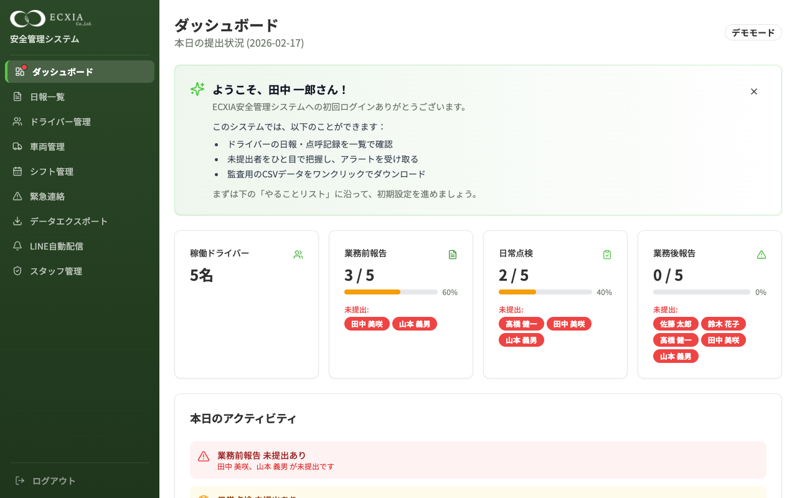

# スタッフの声から生まれた5つの新機能 ― ECXIA安全管理システム アップデート

**2026年2月17日**

---

## はじめに

ECXIA安全管理システムは、軽貨物ドライバーの日報・点呼・点検をLINEから入力するだけで法令を完全に守れるクラウドシステムです。

今回、**現場スタッフからの生の声**をもとに、5つの新機能を追加しました。

「こうだったらもっと使いやすいのに」という要望を一つひとつ拾い上げ、システムに反映しています。

---

## スタッフから寄せられた5つの要望

| # | スタッフの声 | 対応した機能 |
|---|------------|------------|
| 1 | 「休みの日にリマインド通知が来るのをやめてほしい」 | リマインダーのシフト連動 |
| 2 | 「誰がいつ出勤するか、一覧で見たい」 | シフト管理ページ |
| 3 | 「急な体調不良や車両故障を、すぐ管理者に伝えたい」 | 緊急連絡機能 |
| 4 | 「特定のドライバーだけのデータを出力したい」 | データエクスポートの絞り込み |
| 5 | 「LINEでエラーが出た時、何をすればいいかわからない」 | エラー画面の案内改善 |

以下、それぞれの対応内容を詳しくご紹介します。

---

## 1. シフト管理ページ（新機能）

### スタッフの声
> 「誰がいつ出勤するか分からない」「休みの日にリマインド通知が来るのをやめてほしい」

### 対応内容

管理画面に**月間カレンダー形式のシフト管理ページ**を追加しました。


*管理画面のシフト管理ページ。ドライバーごとに日別の出勤/休みを一覧で管理できます。*

**できること：**
- ドライバーごとに「出勤」「休み」「午前のみ」「午後のみ」を設定
- **日別の出勤人数**が上部に表示され、人手が足りない日が一目でわかる
- 「平日出勤テンプレート適用」ボタンで、平日=出勤・土日=休みを一括設定
- 今日の日付が緑枠でハイライト

### ドライバーもLINEからシフト申請できます


*ドライバーのLINE画面。カレンダーで日付をタップするだけで、出勤/休みを申請できます。*

ドライバーは自分のスマホのLINEから、希望する出勤日・休みを申請できます。管理者は管理画面で全員分をまとめて確認・調整できます。

### 効果
- **リマインド通知が休みのドライバーに届かなくなりました**（最大の要望に対応）
- 人員配置の過不足が事前に把握でき、配車計画が立てやすくなります
- ドライバーが自分でシフトを申請できるため、管理者の手間が減ります

---

## 2. 緊急連絡機能（新機能）

### スタッフの声
> 「急な体調不良や車両故障を、すぐ管理者に伝えたい」

### 対応内容

ドライバーがLINEからワンタップで緊急連絡を送れる機能を追加しました。


*ドライバーのLINE画面。「体調不良」「車両故障」「事故」「家庭の事情」「その他」から選んで送信するだけ。*

**ドライバー側（LINE）：**
- 5つの連絡種別から選択：体調不良・車両故障・事故・家庭の事情・その他
- 詳しい状況を任意で記入
- 送信ボタン1つで完了

**管理者側への影響：**
- 緊急連絡が送信されると、**管理者のLINEに即座に通知**が届きます
- 本日のシフトが自動的に「欠勤」に切り替わります
- 朝のリマインド通知も自動で停止されます


*管理画面の緊急連絡ページ。未対応の連絡が一覧で表示され、「対応完了」ボタンで処理できます。*

### 効果
- 電話やチャットで個別に連絡する手間がなくなります
- 管理者への伝達漏れを防止
- 対応状況（誰がいつ対応したか）が記録に残ります

---

## 3. リマインダーのシフト連動（改善）

### スタッフの声
> 「休みの日に通知が来るのが嫌」「業務前を出してない人に退勤リマインドが来ても意味がない」

### 対応内容

毎日の自動通知を、シフト状況に合わせて賢く出し分けるようにしました。

| 通知 | 改善前 | 改善後 |
|------|--------|--------|
| 朝8:00 リマインド | 全員に送信 | **休みの人には送らない** |
| 9:30 業務前未提出アラート | 全員にチェック | **出勤予定者だけチェック** |
| 19:00 業務後未提出アラート | 全員にチェック | **業務前報告を出した人だけチェック** |
| 10:00 管理者サマリー | 全員の提出率 | **出勤○名/休み○名＋緊急連絡○件** も表示 |

### 効果
- 休みのドライバーに不要な通知が届かなくなり、ストレスが軽減
- 業務後アラートの精度が上がり、本当に出し忘れている人だけに届く
- 管理者サマリーに出勤状況と緊急連絡件数が加わり、より実態に即した情報が得られる

---

## 4. データエクスポートの絞り込み（改善）

### スタッフの声
> 「特定のドライバーのデータだけ出したい」「事故対応で佐藤さんだけのデータが必要な時がある」

### 対応内容

CSV出力（データダウンロード）画面に、**ドライバーと車両の絞り込みフィルタ**を追加しました。


*データエクスポートページ。開始日・終了日に加え、ドライバーと車両でも絞り込めるようになりました。*

**できること：**
- 期間（開始日〜終了日）で絞り込み
- ドライバーを選んで、その人だけのデータを出力
- 車両を選んで、その車だけのデータを出力
- 業務前報告・業務後報告・日常点検・事故報告の4種類をそれぞれCSVダウンロード

### 効果
- 監査や事故対応で「この人のこの期間だけ」のデータがすぐに取り出せる
- 全データをダウンロードしてからExcelで手作業で絞り込む手間がなくなる

---

## 5. LINEエラー画面の案内改善

### スタッフの声
> 「エラーが出た時、何をすればいいか分からない」

### 対応内容

LINEアプリでエラーが発生した時に、**「何が起きたか」と「何をすればいいか」**を分かりやすく表示するようにしました。

**改善前：**
- 「エラー」とだけ表示され、対処方法が分からなかった

**改善後：**
- エラーの原因に応じて、具体的な対処手順を番号付きで表示
- 「再読み込み」ボタンを追加
- エラー詳細も表示されるので、管理者への問い合わせがスムーズ

| エラーの種類 | 表示される案内 |
|------------|-------------|
| LINE認証エラー | 「LINEアプリの画面下部メニューからアクセスしてください」 |
| ドライバー未登録 | 「管理者から受け取った登録URLを開いてください」 |
| 友だち未追加 | 「LINE公式アカウントを友だち追加してください」 |
| 通信エラー | 「電波の良い場所で再度お試しください」 |

### 効果
- ドライバーが自力で問題を解決できるケースが増える
- 管理者への「使えない」「エラーが出た」の問い合わせが減る

---

## さらに追加した機能

スタッフの要望に応えるだけでなく、**「この機能があれば、もっと便利になるはず」**という視点で以下も追加しました。

### 管理者LINE通知の強化

緊急連絡が届いた時に、管理者のLINEに即座にプッシュ通知が送られます。

通知内容の例：
```
🚨 緊急連絡

佐藤 太郎さんから緊急連絡がありました。
種別: 体調不良・欠勤
理由: 朝から熱が38度あるため休みます

管理画面の「緊急連絡」ページで確認してください。
```

### シフトと緊急連絡の自動連動

- 緊急連絡を送ると → シフトが自動で「欠勤」に変更
- シフトが「休み」のドライバー → 朝のリマインドが自動で停止
- 管理者サマリーに → 出勤/休みの人数と緊急連絡の件数が自動表示

**一つの操作が、関連する全ての機能に自動で反映される**ため、管理者が手動であちこち設定を変える必要がありません。

---

## ダッシュボード

参考：システム全体のダッシュボード画面です。


*ダッシュボード。本日の提出状況が一目でわかります。未提出者は赤色で表示されます。*

---

## まとめ

| 要望 | 対応 | 効果 |
|------|------|------|
| 休みの日に通知が来る | シフト連動リマインダー | 不要な通知ゼロへ |
| 誰がいつ出勤か分からない | シフト管理ページ | 月間の人員配置が一目瞭然 |
| 急な連絡手段がない | 緊急連絡機能 | LINEからワンタップ＋管理者に即通知 |
| 特定の人のデータだけ出したい | エクスポート絞り込み | ドライバー・車両で即フィルタ |
| エラーが出て何もわからない | エラー案内改善 | 対処手順を自動表示 |

**現場の声がシステムを成長させます。**
引き続き、スタッフの皆さまからのフィードバックをお待ちしております。

---

*ECXIA安全管理システム — 株式会社ソウルシンクス開発*
